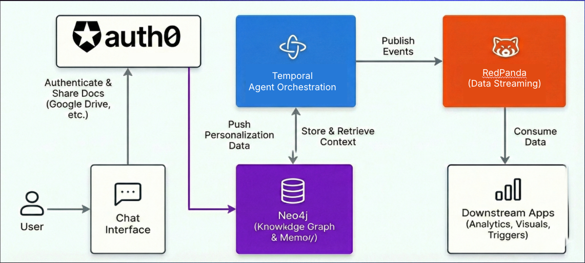

# Temporal Interactive Deep Research Demo using OpenAI Agents SDK


This repository builds on the Temporal Interactive Deep Research Demo by @steveandroulakis and now highlights the full joint solution. Temporal provides the orchestration backbone, Neo4j serves as the knowledge graph store for conversation memory, Redpanda Data streams structured workflow events to downstream consumers, and Auth0 secures tool calls and agent access. A web-based interface stitches the full experience together for interactive research sessions. View the architecture reference diagram below for an overview of how each component connects.



For detailed information about the research agents in this repo, see [openai_agents/workflows/research_agents/README.md](openai_agents/workflows/research_agents/README.md)
Access original repo [here](https://github.com/steveandroulakis/openai-agents-demos)

## Key Features

- **Temporal Orchestration**: Temporal manages durable and observable workflows and activities across the system
- **Neo4j Knowledge Store**: Neo4j persistently captures conversations, workflow history, and memory for resumable sessions
- **Redpanda Data Streaming**: Workflow events stream through Redpanda for analytics, monitoring, and downstream automation
- **Auth0 Security**: Auth0 protects the UI, tool calls, and agent access tokens across the stack
- **OpenAI Agents**: Powered by the OpenAI Agents SDK for natural language processing
- **Multi-Agent Interactive Research**: Clarifying, planning, searching, writing, and artifact generation agents collaborate in real time
- **PDF Generation**: Interactive workflow produces professionally formatted reports alongside markdown deliverables

## About this Demo: Multi-Agent Interactive Research Workflow

An enhanced version of the research workflow with interactive clarifying questions to refine research parameters before execution and optional PDF generation.

This example is designed to be similar to the OpenAI Cookbook: [Introduction to deep research in the OpenAI API](https://cookbook.openai.com/examples/deep_research_api/introduction_to_deep_research_api)

**Files:**

- `openai_agents/workflows/interactive_research_workflow.py` - Interactive research workflow
- `openai_agents/workflows/research_agents/` - All research agent components
- `openai_agents/run_interactive_research_workflow.py` - Interactive research client
- `openai_agents/workflows/pdf_generation_activity.py` - PDF generation activity
- `openai_agents/workflows/research_agents/pdf_generator_agent.py` - PDF generation agent

**Agents:**

- **Triage Agent**: Analyzes research queries and determines if clarifications are needed
- **Clarifying Agent**: Generates follow-up questions for better research parameters
- **Instruction Agent**: Refines research parameters based on user responses
- **Planner Agent**: Creates web search plans
- **Search Agent**: Performs web searches
- **Writer Agent**: Compiles final research reports
- **PDF Generator Agent**: Converts markdown reports to professionally formatted PDFs

## Prerequisites

1. **Python 3.10+** - Required for the demos
2. Temporal Server - Must be running locally on localhost:7233 OR Connect to [Temporal Cloud](https://temporal.io)
3. **OpenAI API Key** - Set as environment variable `OPENAI_API_KEY` in .env file (note, you will need enough quota on in your [OpenAI account](https://platform.openai.com/api-keys) to run this demo)
4. **PDF Generation Dependencies** - Required for PDF output (optional)
5. **Neo4j Database** (optional) - For conversation memory/persistence. See [Neo4j Setup](#neo4j-setup-optional) below.
6. **Redpanda** (optional) - For real-time event streaming of workflow progress. See [Redpanda Setup](#redpanda-setup-optional) below.

## Install / Upgrade Temporal CLI
You'll need the latest version to run the demo.

```bash
# Install Temporal CLI
curl -sSf https://temporal.download/cli.sh | sh

# Alternately, upgrade to the latest version:
brew upgrade temporal
```

### Run Temporal Server Locally

```
# Start Temporal server
temporal server start-dev
```

### Or, Connect to Temporal Cloud

1. Uncomment the following line in your `.env` file:

```
# TEMPORAL_PROFILE=cloud
```

2. Run the following commands:

```
temporal config set --profile cloud --prop address --value "CLOUD_REMOTE_ADDRESS"
temporal config set --profile cloud --prop namespace  --value "CLOUD_NAMESPACE"
temporal config set --profile cloud --prop api_key --value "CLOUD_API_KEY"
```

See https://docs.temporal.io/develop/environment-configuration for more details.

For ease of use, all environemnt variables may be defined through the `.env` file,
at the root of the repository. See the .env-sample file for details.

## Neo4j Setup (Optional)

Neo4j is used to persist conversation/workflow history, allowing users to resume previous conversations after page reloads. The app will work without Neo4j, but conversations won't be saved or resumable.

### Option 1: Neo4j AuraDB (Cloud)

1. Sign up for [Neo4j AuraDB](https://neo4j.com/cloud/aura/)
2. Create a free instance
3. Copy the connection URI and credentials
4. Update your `.env` file:
   ```
   NEO4J_URI=neo4j+s://your-instance.databases.neo4j.io
   NEO4J_USER=neo4j
   NEO4J_PASSWORD=your-password
   ```

### Option 2: Local Docker

```bash
docker run \
    --name neo4j-research \
    -p7474:7474 -p7687:7687 \
    -e NEO4J_AUTH=neo4j/your-password \
    neo4j:latest
```

Then update your `.env` file:
```
NEO4J_URI=bolt://localhost:7687
NEO4J_USER=neo4j
NEO4J_PASSWORD=your-password
```

**Note:** If Neo4j is not configured, all features will work except cached conversations.

## Redpanda Setup (Optional)

Redpanda provides real-time event streaming for workflow progress tracking. The app works without Redpanda, but when configured, you can stream workflow events (clarifications, search progress, image generation, report completion, etc.) to external consumers for monitoring, analytics, or custom UI integrations.

**📖 For detailed setup, monitoring, and troubleshooting, see [REDPANDA.md](REDPANDA.md)**

### Event Types

When Redpanda is configured, the following events are streamed:

**Lifecycle Events:**
- `query_received` - User submits initial research query
- `research_started` - Research pipeline begins after clarifications
- `research_complete` - Entire workflow finished with results

**Clarification Events:**
- `clarifications_generated` - Questions created by triage agent
- `clarification_answered` - Single answer received (includes progress)
- `clarifications_complete` - All clarification answers collected

**Research Pipeline Events:**
- `knowledge_graph_hit` - Exact match found in knowledge graph (cached result)
- `search_plan_created` - Search plan generated with number of searches
- `search_executing` - Web search progress updates (current/total)
- `report_writing` - Report generation starts
- `report_generated` - Markdown report complete

**Artifact Generation Events:**
- `image_generation_started` - Image generation begins (runs in parallel)
- `image_generated` - Image ready with file path
- `pdf_generation_started` - PDF conversion begins
- `pdf_generated` - PDF ready with file path

### Option 1: Redpanda Serverless (Recommended)

1. Sign up for [Redpanda Cloud](https://redpanda.com/try-redpanda)
2. Create a Serverless cluster
3. Create a topic (e.g., `research-workflow-events`)
4. Get your connection credentials
5. Update your `.env` file:
   ```bash
   REDPANDA_BOOTSTRAP_SERVERS='your-broker-1.redpanda.cloud:9092,your-broker-2.redpanda.cloud:9092'
   REDPANDA_TOPIC='research-workflow-events'
   REDPANDA_SASL_MECHANISM='SCRAM-SHA-256'
   REDPANDA_SASL_USERNAME='your-username'
   REDPANDA_SASL_PASSWORD='your-password'
   REDPANDA_SECURITY_PROTOCOL='SASL_SSL'
   ```

### Option 2: Local Redpanda (Docker)

**1. Start Redpanda container:**
```bash
docker run -d \
  --name redpanda \
  -p 9092:9092 \
  -p 9644:9644 \
  docker.redpanda.com/redpandadata/redpanda:latest \
  redpanda start \
  --smp 1 \
  --memory 1G \
  --overprovisioned \
  --node-id 0 \
  --kafka-addr PLAINTEXT://0.0.0.0:29092,OUTSIDE://0.0.0.0:9092 \
  --advertise-kafka-addr PLAINTEXT://redpanda:29092,OUTSIDE://localhost:9092
```

**2. Create the topic:**
```bash
# Create the main topic
docker exec -it redpanda rpk topic create research-workflow-events

# (Optional) Create separate topics for different event categories
docker exec -it redpanda rpk topic create workflow-lifecycle
docker exec -it redpanda rpk topic create workflow-clarifications
docker exec -it redpanda rpk topic create workflow-research
docker exec -it redpanda rpk topic create workflow-artifacts
```

**3. Verify topic creation:**
```bash
docker exec -it redpanda rpk topic list
```

**4. Update your `.env` file:**
```bash
REDPANDA_BOOTSTRAP_SERVERS='localhost:9092'
REDPANDA_TOPIC='research-workflow-events'
```

**Note:** Topics can also be auto-created when the first message is published, but explicit creation allows you to configure retention, partitions, and other settings upfront.

### Option 3: Self-Hosted Redpanda

Follow the [Redpanda installation guide](https://docs.redpanda.com/docs/deploy/deployment-option/) for your environment, then configure the connection details in your `.env` file.

### Monitoring & Verifying Events

**Quick Start - Watch Events in Real-Time:**
```bash
# Use rpk to watch events as they stream in
docker exec -it redpanda rpk topic consume research-workflow-events -f '%v\n' | jq .
```

**Redpanda Console (Web UI):**

For a visual interface, run Redpanda Console:
```bash
docker run -d \
  --name redpanda-console \
  --network redpanda-network \
  -p 8080:8080 \
  -e KAFKA_BROKERS=redpanda:29092 \
  docker.redpanda.com/redpandadata/console:latest
```

Then open http://localhost:8080 to view topics, messages, and metrics.

**More Options:**
- See [REDPANDA.md](REDPANDA.md) for detailed monitoring options, troubleshooting, and advanced configuration

### Topic Routing (Advanced)

You can route different event categories to separate topics for fine-grained control:

```bash
# Single topic for all events (default)
REDPANDA_TOPIC='research-workflow-events'

# Or separate topics per category
REDPANDA_TOPIC_LIFECYCLE='workflow-lifecycle'
REDPANDA_TOPIC_CLARIFICATIONS='workflow-clarifications'
REDPANDA_TOPIC_RESEARCH='workflow-research'
REDPANDA_TOPIC_ARTIFACTS='workflow-artifacts'
```

### Event Payload Format

All events follow this structure:
```json
{
  "event_type": "search_executing",
  "workflow_id": "workflow-id-123",
  "timestamp": "2026-01-13T12:34:56.789Z",
  "data": {
    "current": 2,
    "total": 5
  }
}
```

**Note:** If Redpanda is not configured (no `REDPANDA_BOOTSTRAP_SERVERS` in `.env`), the app will work normally without event streaming. All workflow functionality remains intact.

### Troubleshooting Redpanda

**Common Issues:**

1. **No events appearing:** Verify topic exists and broker is running
   ```bash
   docker ps | grep redpanda
   docker exec -it redpanda rpk topic list
   ```

2. **Connection refused:** Ensure Redpanda is running and `.env` has `REDPANDA_BOOTSTRAP_SERVERS='localhost:9092'`

3. **Console not connecting:** Use Docker network method (see [REDPANDA.md](REDPANDA.md#docker-network-setup-recommended))

For detailed troubleshooting, advanced configuration, and monitoring options, see **[REDPANDA.md](REDPANDA.md)**.

## Setup

1. Clone this repository
2. Install dependencies:

   ```bash
   uv sync
   ```

   Note: If uv is not installed, please install uv by following the instructions [here](https://docs.astral.sh/uv/getting-started/installation/)

3. Set your [OpenAI API](https://platform.openai.com/api-keys) key:
   ```bash
   # Add OpenAI API key in .env file (copy .env-sample to .env and update the OPENAI_API_KEY)
   OPENAI_API_KEY=''
   ```

## Running the Demos

### 1. Start the Worker

In one terminal, start the worker that will handle all workflows:

```bash
uv run openai_agents/run_worker.py
```

Keep this running throughout your demo sessions. The worker registers all available workflows and activities.
You can run multiple copies of workers for faster workflow processing. Please ensure `OPENAI_API_KEY` is set before
you attempt to start the worker.

### 2. Run the UI

In another terminal:

```bash
uv run ui/backend/main.py
```

This will launch the Interactive Research App on http://0.0.0.0:8234


### 3. (Optional) Start Neo4j

If you've configured Neo4j for conversation memory:

```bash
# If using Docker
docker start neo4j-research

# If using Neo4j Desktop, start your database from the Desktop app
```

### 4. Use the Demo

**Conversation Memory Features:**
- Click the menu button (☰) in the top-right to view previous conversations
- Click on any conversation to resume it
- Your current conversation is automatically saved and can be resumed after page reload

In Google Chrome, go to chrome://flags/ search for "Split View" and enable it.

Close and re-open Chrome for it to take effect.

Open a new browser window with two tabs:

* Tab 1: Application UI — http://0.0.0.0:8234
* Tab 2: Temporal UI — http://localhost:8233/ (OSS) or https://cloud.temporal.io/namespaces/XXX/workflows (Temporal Cloud)

Right-click Tab 1, choose Add Tab to New Split View, and click the Workflows tab as the right-hand side.

Re-position the window divider so that the chat UI is taking up approximately 1/3 of the screen, leading the rest for the Temporal UI.


**Output:**

- `research_report.md` - Comprehensive markdown report
- `pdf_output/research_report.pdf` - Professionally formatted PDF (if PDF generation is available)

**Note:** The interactive workflow may take 2-3 minutes to complete due to web searches and report generation.

## Development

### Code Quality Tools

```bash
# Format code
uv run -m black .
uv run -m isort .

# Type checking
uv run -m mypy --check-untyped-defs --namespace-packages .
uv run pyright .
```

## License

MIT License - see the original project for full license details.
